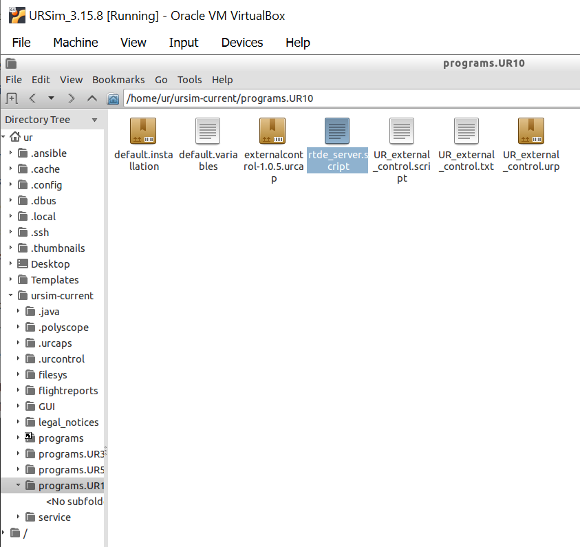
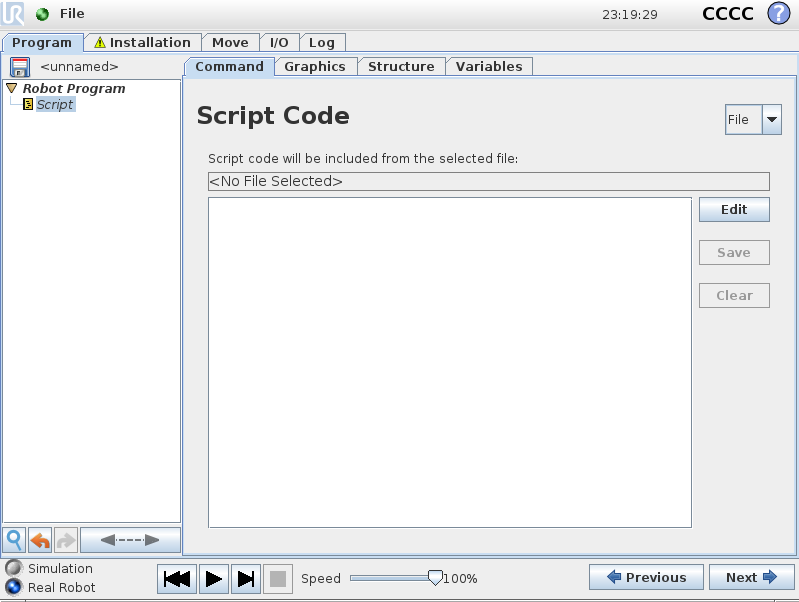
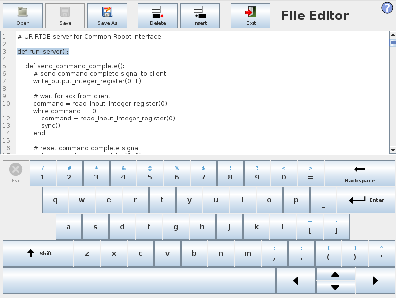
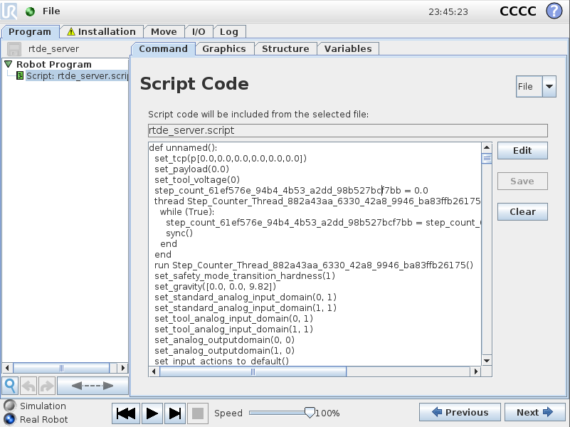

# How to upload rtde_server.script file to a Universal Robots arm and convert to urp file

## 1. Purpose
This page mainly explains about uploading rtde_server.script file into a Universal Robots arm and convert it to urp file. By taking steps of the following description, you can control your UR arm using a Python script based on [Common Robot Interface (CRI)](https://github.com/jlloyd237/cri) developed by Dr. John Lloyd.

Here, I explain "Uploading and running the server" part in more detailed manner for UR arms.

## 2. Uploading "rtde_server.script" to the UR arm

First of all, clone the git repository to your host PC.

```consol
user@ubuntu:~$ git clone https://github.com/jlloyd237/cri.git
```

and find `/cri/ur/rtde_server.script` file. You need to transfer this file to the UR robot. Follow as the status of your robot.


### 2.1. File transfer to the real UR robot

The best way is to copy the file into a USB stick, and you insert the stick to the teach pandent, and load it.

Second way is to use ftp program. My recommendation is `FileZilla`. To access to the robot you need to know

- IP address (check from the teach pendant)
- ID: root (in my robot's case)
- PW: easybot (in my robot's case)
- port: 22 (or 25?)


### 2.2. File transfer to Non-linux URSim polyscope software on VirtualBox

Please follow [here](https://academy.universal-robots.com/media/jiehhszc/ursim_vmoracle_installation_guidev03_en.pdf). Making long story short, you need to set a shared folder that the VirtualBox (Lubuntu) can access to (page 15). Locate the `rtde_server.script` in the shared folder on the main OS (Windows in my case) (page 19). Launch the virtual OS (Lubuntu) and access to the folder. Copy the file and paste it into `Programs URx` folder on the desktop.


## 3. Convert script file to urp file

First, I pasted the script file into a `Program` folder.



On the PolyScope Robot User Interface, `Program Robot` &rarr; `Empty Program`. In the program tree, click `Robot Program`. Under `Structure` tab, click `Advanced` tab. Then, click `Script Code` button.

In the tree, click `Script` and click `Command` tab. On the right top corner, switch `Line` to `File`.



Click `Edit` and `Open`, and select `rtde_server.script`.

**Important!!** Sometimes (or in many cases), the script file is not properly loaded and you would see weird scripts in the initial lines. You should double-check the script starts from `def run_server():`, such as the captured image below.



Click `Exit` and double-check the script starts from `def run_server():`. If it seems no error, you can save the script as urp file (In the top menu, `File` &rarr; `Save as`).

Now, you can `Exit` from the menu and try to load the recently saved urp file.

**Important!!** You should always double-check the script looks fine. When I loaded the saved `rtde_server.urp` file, I could see the improper scripts, such as below.



In this case, you should remove both script and urp files and repeat this procedure.


If there is no more errors in the script, you can test with a Python file. First, click the play button. On your main OS where CRI has been installed, try to excecute an example code (Check the original [CRI repository](https://github.com/jlloyd237/cri)).

