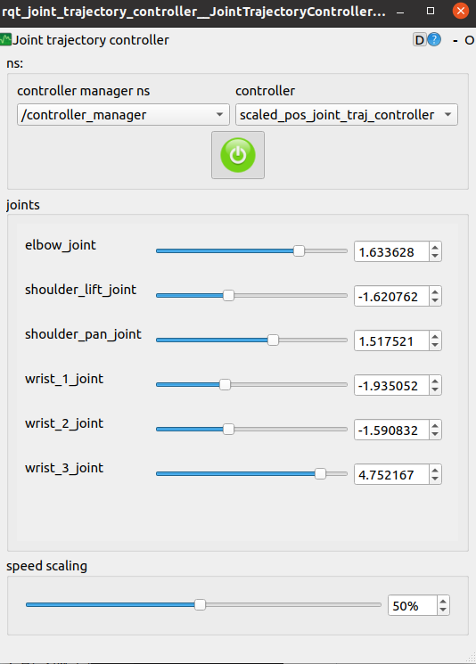

# Install UR10 (CB-series) on ROS Noetic

## 1. Conditions
- OS: Ubuntu 20.04.5 LTS 64-bit
- Robot: UR10 (CB series)
- Polyscope version: 3.15.8

## 2. Install ROS Noetic
Please follow the [official instructuion](http://wiki.ros.org/noetic/Installation/Ubuntu).

## 3. Install Moveit 1 - Noetic
Please remember that all packages (e.g., Moveit) should be downloaded in `src` folder of your workspace. In addition, I assume that your workspace is set as `~/catkin_ws`

First of all, please follow the [official instruction](https://ros-planning.github.io/moveit_tutorials/doc/getting_started/getting_started.html) until the section called **Create A Catkin Workspace and Download MoveIt Source**.

You need to remove `panda_moveit_config` folder in `~/catkin_ws/src`, and keep following the section **Download Example Code**.

## 4. Install "Universal Robots ROS Driver"
Please follow the [official instruction](https://github.com/UniversalRobots/Universal_Robots_ROS_Driver).

I had tried to set up for real-time control by updating the kernel, but no solution was successful so far on the virtual OS. Therefore, I skipped the part.

However, it is important to take step on **Extract calibration information** section. Once you created "my_robot_calibration.yaml" file, you should follow [this page](https://github.com/UniversalRobots/Universal_Robots_ROS_Driver/blob/master/ur_calibration/README.md).

After creating `example_organization_ur_launch`, go to `~/catkin_ws` and execute `catkin_make`. Next, go to `~/catkin_ws/src/Universal_Robots_ROS_Driver/ur_robot_driver/launch` and open **ur10_bringup.launch** file (such as, `gedit ur10_bringup.launch`).

Finally, modify two places.

```xml
<arg name="robot_ip" default="xxx.xxx.xxx.xxx" doc="IP address by which the robot can be reached."/>
```
Please change "xxx.xxx.xxx.xxx" to the robot's ip address.


```xml
<arg name="kinematics_config" default="$(find example_organization_ur_launch)/etc/ur10_calibration_file.yaml" doc="Kinematics config file used for calibration correction. This will be used to verify the robot's calibration is matching the robot_description."/>
```
Please change `ur10_calibration_file.yaml` to your calibration file in `~/catkin_ws/example_organization_ur_launch/etc`.

## 5. Test the UR10 on ROS using a Python code

### 5.1. Controlling joints in Rviz
```bash
source ~/catkin_ws/devel/setup.bash
roslaunch ur_robot_driver ur10_bringup.launch
```
Go to the teach pandent and "Load Program" -> select "ExternalControl.urp" -> click "Play" button. You should see the following texts in the terminal.
```terminal
...
[ INFO] [1673022143.409260151]: Robot requested program
[ INFO] [1673022143.409319641]: Sent program to robot
[ INFO] [1673022143.712384573]: Robot connected to reverse interface. Ready to receive control commands.
```

Open another terminal and execute the following.
```bash
rosrun rqt_joint_trajectory_controller rqt_joint_trajectory_controller
```
> You may need to install rqt_joint_trajectory_controller by running:
`sudo apt install ros-<ROS-DISTRO>-rqt-joint-trajectory-controller`



Click the "Turning on" button and see if the UR arm is moving as the joint value changes.

In addition, make a note with the six joint values.

Download [this file](https://github.com/AnthonyLe93/ur_robot_driver/blob/master/scripts/ur10_movit_control.py) and save it in `~/catkin_ws/src/Universal_Robots_ROS_Driver/ur_robot_driver/scripts`. 

Open the Python file and change the position informations. In particular, #20, #71-76, #96-137. I changed the file name to **ur10_lightblue_moveit_control.py**. **Important!!** Depending on the value, the UR arm can harm you! Be careful of setting the value.

To test the Python code, execute each line in each terminal:
```console
$ roslaunch ur10_moveit_config moveit_planning_execution.launch
$ roslaunch ur10_moveit_config moveit_rviz.launch rviz_config:=$(rospack find ur10_moveit_config)/launch/moveit.rviz
$ rosrun ur_robot_driver ur10_lightblue_moveit_control.py 
```