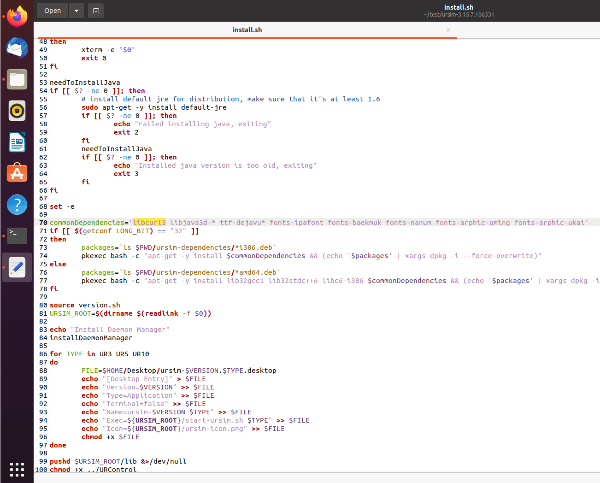
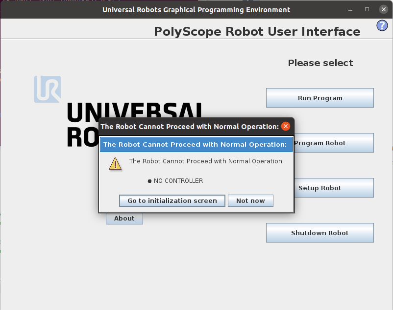
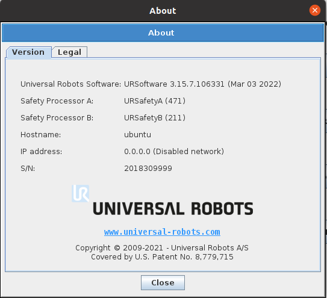
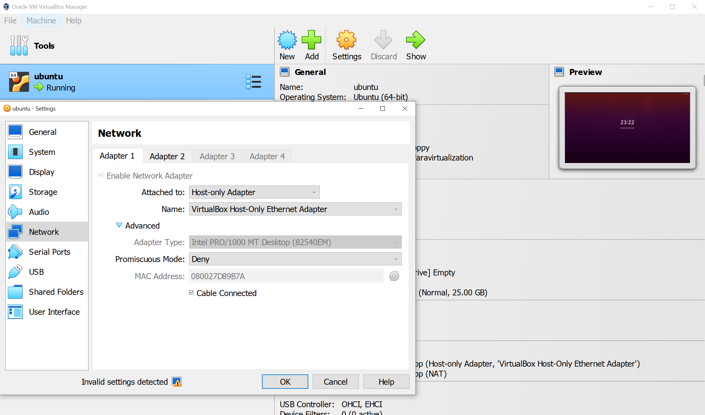
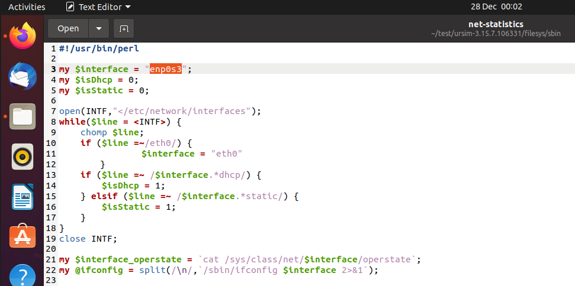
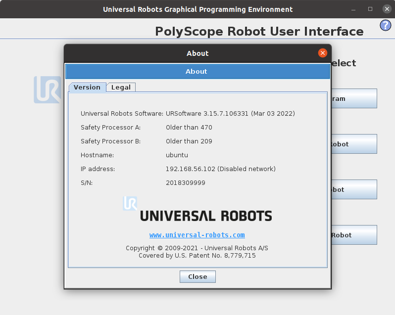

# Install URSim on your virtual machine

## 1. What is URSim?

It is called **Universal Robots Offline Simulator** in a long expression. Near a UR robot arm, you can see a software on the display of the teach pendant. URSim has the exactly same GUI. Because the software's title is Polyscope, some people exchangeably call URSim with Polyscope.


## 2. Why do we need virtual machine?
    
In most cases, we control a UR robot arm from a remote computer. The robot accepts commands from the computer via network communications. <!-- In the case that users want to test some doubtful commands, testing with a real robot is risky. This is a major reason why we need -->

The main reason for installing a URSim (Polyscope) on the virtual machine is to create a similar computer-robot communication enviroment.


## 3. Installing a virtual machine

I used [VirtualBox](https://www.virtualbox.org/). You can install with basic (recommended) options.


Once installed, you have two options:
    
either 1) [Installing URSim on Linux](#4-installing-ursim-on-linux-on-virtualbox)
    

    
 or 2) [Installing URSim on Non-Linux](#5-installing-ursim-on-non-linux-on-virtualbox).


## 4. Installing URSim on Linux (on VirtualBox)

### 4.1. Install Linux (Ubuntu)

You first need to decide the version of Linux and download it. In this example, I downloaded Ubuntu 20.04 LTS. Please refer to other websites introducing steps to install Linux on VirtualBox.

### 4.2. Download URSim

Next, let's download URSim software in Linux from the official [Universal Robots' download webpage](https://www.universal-robots.com/download). Make sure that the Linux has internet connection. In the download website, expand **Software** section in the list on your left, and tick **Linux Offline Simulator**. Find the model you want by clicking "LOAD MORE RESULTS". You need to download a **Linux only version**. For example, I downloaded "OFFLINE SIMULATOR - CB-SERIES - LINUX - URSIM-3.15.7" (Log in is required).


### 4.3. Install URSim in Linux

Extract the downloaded file at the location you want to install. Then, locate a folder where **install.sh** is located. In my case, the file is under *$HOME/test/ursim-3.15.7.106331*.

Execute:
```consol
user@ubuntu:~/test/ursim-3.15.7.106331$ ./install.sh
```

In most cases, you will see the following error regarding java version.

```consol
user@ubuntu:~/test/ursim-3.15.7.106331$ ./install.sh
Checking java version
/usr/bin/java
version 11.0.17
Reading package lists... Done
Building dependency tree
Reading state information... Done
default-jre is already the newest version (2:1.11-72).
0 to upgrade, 0 to newly install, 0 to remove and 31 not to upgrade.
Checking java version
/usr/bin/java
version 11.0.17
Installed java version is too old, exiting
```

This is mainly because URSim is installable based on Java 1.8 (JDK 8). You need downgrade your java version to 1.8 ([source](https://uk.mathworks.com/help/supportpkg/robotmanipulator/ug/setup-ursim-offline-simulator.html)).

4.3.1. Install JDK 8
```consol
    >> sudo apt-get update
    >> sudo apt-get install openjdk-8-jdk -y
```

4.3.2. Select the JDK 8
```consol
    >> sudo update-alternatives --config javac
```
and try to select Java 1.8. Next execute

```consol
    >> sudo update-alternatives --config java
    There are 2 choices for the alternative java (providing /usr/bin/java).

      Selection    Path                                            Priority   Status
    ------------------------------------------------------------
    * 0            /usr/lib/jvm/java-11-openjdk-amd64/bin/java      1111      auto mode
      1            /usr/lib/jvm/java-11-openjdk-amd64/bin/java      1111      manual mode
      2            /usr/lib/jvm/java-8-openjdk-amd64/jre/bin/java   1081      manual mode

    Press <enter> to keep the current choice[*], or type selection number: 2
    update-alternatives: using /usr/lib/jvm/java-8-openjdk-amd64/jre/bin/java to provide /usr/bin/java (java) in manual mode
```

When you execute "./install.sh", you will see an error regarding **libcurl3** package, such as the below:
```consol
    user@ubuntu:~/test/ursim-3.15.7.106331$ ./install.sh
    Checking java version
    /usr/bin/java
    version 1.8.0_352
    java version accepted
    Reading package lists... Done
    Building dependency tree       
    Reading state information... Done
    Note: selecting 'libjava3d-jni' for glob 'libjava3d-*'
    Note: selecting 'libjava3d-java-doc' for glob 'libjava3d-*'
    Note: selecting 'libjava3d-java' for glob 'libjava3d-*'
    Note: selecting 'ttf-dejavu-core' for glob 'ttf-dejavu*'
    Note: selecting 'ttf-dejavu-extra' for glob 'ttf-dejavu*'
    Note: selecting 'ttf-dejavu' for glob 'ttf-dejavu*'
    Package libcurl3 is not available, but is referred to by another package.
    This may mean that the package is missing, has been obsoleted, or
    is only available from another source
    However the following packages replace it:
    libcurl4:i386 libcurl4

    E: Package 'libcurl3' has no installation candidate
```

In this case, you need to edit "install.sh" file using an editor. For example,
```consol
    user@ubuntu:~/test/ursim-3.15.7.106331$ gedit install.sh
```

and change libcurl3 to **libcurl4**, located around 70 lines in the file.




Now, let's run the application (I want UR10).
```consol
    user@ubuntu:~/test/ursim-3.15.7.106331$ ./start-ursim.sh UR10
```


### 4.4. Controller setup



If you see "No Controller" alert, you need to open another terminal without closing the URSim application, go to the installed folder, and execute:
```consol
    user@ubuntu:~/test/ursim-3.15.7.106331$ sudo ./starturcontrol.sh
```


### 4.5. Network setup

This part was the trickiest to me, because no websites in the internet was helpful.

An important conclusion I have learned is that network communication is still possible under an appropriate setup even if the URSim software keeps tell that the network is disabled.



Therefore, it is meaningless to try to enable the network using DHCP or Static address on the URSim software. (Of course, you can do it on the teaching pandent of a real UR robot arm if you have. I am only talking about the network setup on the URSim.)

#### 4.5.1. Network setup on the Virtual Machine

First, turning off the virtual Linux if you are running it. On the list of virtual OS programs, select the virtual Linux, right click, and go to "Settings". Under the Network, enable "Adapter 1" and "Adapter 2".

On the "Adapter 1" tab, choose "Host-only Adapter". I believe this adapter will help you to communicate to the URSim.


On the "Adapter 2" tab, choose "NAT" without any special settings. By this adapter, you may use internet in the virtual Linux based on the internet connection of your main OS.

Launch the virtual Linux.


#### 4.5.2. Edit Net-statistics file

First, you need to figure out network names. Open Terminal and execute "ifconfig".

```consol
    user@ubuntu:~$ ifconfig
    enp0s3: flags=4163<UP,BROADCAST,RUNNING,MULTICAST>  mtu 1500
            inet 192.168.56.102  netmask 255.255.255.0  broadcast 192.168.56.255
            inet6 fe80::a00:27ff:fed8:9b7a  prefixlen 64  scopeid 0x20<link>
            ether 08:00:27:d8:9b:7a  txqueuelen 1000  (Ethernet)
            RX packets 1  bytes 590 (590.0 B)
            RX errors 0  dropped 0  overruns 0  frame 0
            TX packets 51  bytes 6022 (6.0 KB)
            TX errors 0  dropped 0 overruns 0  carrier 0  collisions 0

    enp0s8: flags=4163<UP,BROADCAST,RUNNING,MULTICAST>  mtu 1500
            inet 10.0.3.15  netmask 255.255.255.0  broadcast 10.0.3.255
            inet6 fe80::a00:27ff:fe47:d23a  prefixlen 64  scopeid 0x20<link>
            ether 08:00:27:47:d2:3a  txqueuelen 1000  (Ethernet)
            RX packets 33  bytes 4560 (4.5 KB)
            RX errors 0  dropped 0  overruns 0  frame 0
            TX packets 87  bytes 9128 (9.1 KB)
            TX errors 0  dropped 0 overruns 0  carrier 0  collisions 0

    lo: flags=73<UP,LOOPBACK,RUNNING>  mtu 65536
            inet 127.0.0.1  netmask 255.0.0.0
            inet6 ::1  prefixlen 128  scopeid 0x10<host>
            loop  txqueuelen 1000  (Local Loopback)
            RX packets 148  bytes 13700 (13.7 KB)
            RX errors 0  dropped 0  overruns 0  frame 0
            TX packets 148  bytes 13700 (13.7 KB)
            TX errors 0  dropped 0 overruns 0  carrier 0  collisions 0
```

I have two networks (**enp0s3** and **enp0s8**) because I set two network adapters in the previous section. You need to remember the network whose ip address is such as 192.168.xxx.xxx. In this case, it should be **enp0s3**.

Next, go to **\<the installed URSim folder\>/filesys/sbin** and open "net-statistics" file with any editor, and please change the interface name as what you have. It is **enp0s3** in my case. Save the file.



Then, launch the URSim again and click "About" button to see if the ip is set as 192.168.xxx.xxx. If not, you need to open the "net-statistics" file again and change line 50, such as

```sh
    #foreach $line (@ifconfig) {
    #    chomp $line;
    #    if($line =~ /inet addr/) {
    #	$addr = $line;
    #	$addr =~ s/.*inet addr:([^ ]*).*/$1/;
    #    }
    #   if($line =~ /Mask/) {
    #	$mask = $line;
    #	$mask =~ s/.*Mask:([^ ]*).*/$1/;
    #    }
    #}

    # Copy and paste the below
    foreach $line (@ifconfig) {
        chomp $line;
        if($line =~ /inet /) {
        $addr = $line;
        $addr =~ s/.*inet ([^ ]*).*/$1/;
        }
        if($line =~ /netmask/) {
        $mask = $line;
        $mask =~ s/.*netmask ([^ ]*).*/$1/;
        }
    }
``` 

Relaunch the URSim and make sure that you can see the ip address by clicking "About" button.

.

If you can see the ip address, setting up for the network communication is done. Please go to [6. Communication test using IP address](#6-communication-test-using-ip-address)

## 5. Installing URSim on Non-Linux (on VirtualBox) 

I basically followed [this Youtube link](https://www.youtube.com/watch?v=oJGPTRlTMPM).

## 6. Communication test using IP address

On your main OS, create a Python file and paste the following codes.

```python
import socket
import time

HOST = "192.168.56.102" # Change this address to your assigned address
PORT = 30002

s = socket.socket(socket.AF_INET, socket.SOCK_STREAM)
s.connect((HOST, PORT))

s.send(("set_digital_out(0,True)"+"\n").encode('utf8'))
time.sleep(2)
s.send(("set_digital_out(0,False)"+"\n").encode('utf8'))

s.close()
```

On your virtual Linux, open the URSim software, click "Program Robot", click "I/O" tab.
As soon as you execute the above Python file, check you can see a light turned on at Digital Output 0.