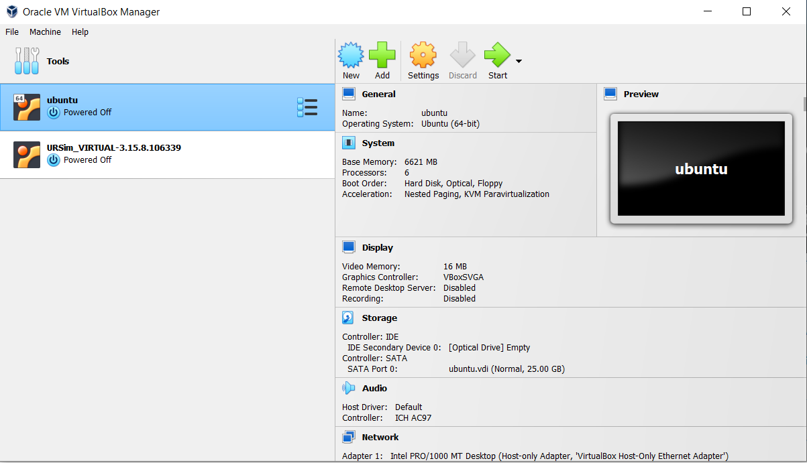
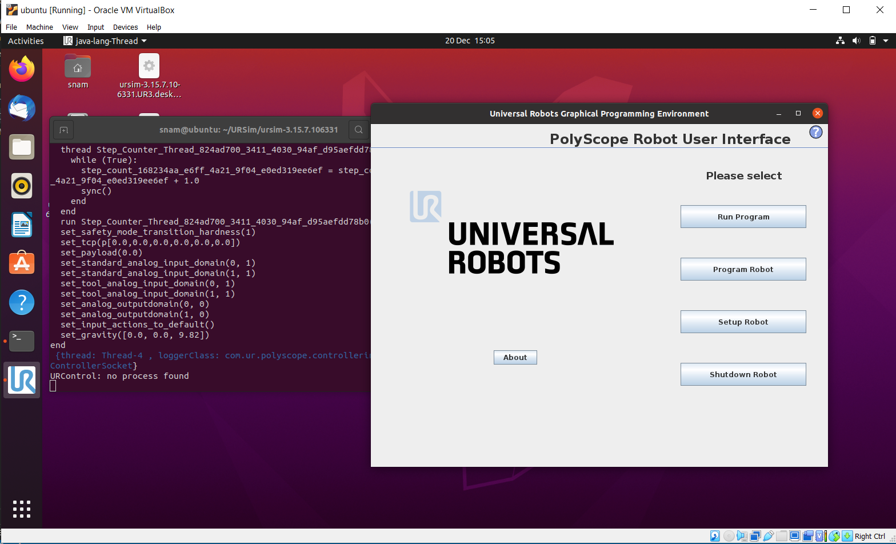
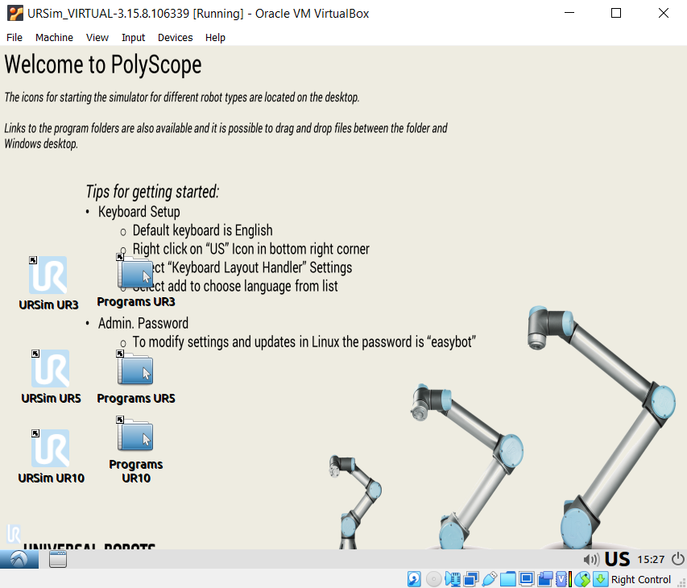

# Install URSim on your virtual machine

1. What is URSim?

    It is called Universal Robots Simulator in a long expression. You can see a software to control a UR robot arm on the display of the teach pendant. URSim has the exactly same GUI. Because the software's title is Polyscope, some people exchangeably call URSim with Polyscope.

2. Why do we need virtual machine?
    
    In most cases, we control a UR robot arm from a remote computer. The robot accepts signals from the computer via network communications.

    The main reason for installing a URSim (Polyscope) on the virtual machine is to create a similar computer-robot communication enviroment.

    

3. Installing a virtual machine

    I used [VirtualBox](https://www.virtualbox.org/). You can install with basic (recommended) options.

    Once installed, you have two options:
    
    either 1) [Installing URSim on Linux](#4-installing-ursim-on-linux-on-virtualbox)
    
    
    
     or 2) [Installing URSim on Non-Linux](#5-installing-ursim-on-non-linux-on-virtualbox).

     

### 4. Installing URSim on Linux (on VirtualBox)

#### 4.1. Install Linux (Ubuntu)

You first need to decide the version of Linux and download it. In this example, I downloaded Ubuntu 20.04 LTS.

#### 4.2. Download URSim

Next, let's download URSim software from the official [Universal Robots website](https://www.universalrobots.com). Make sure that the Linux has internet connection. In the UR website, go to download and expand **Software** section in the list on your left, and tick **Linux Offline Simulator**. Download the model you want (CB3 in my case).

#### 4.3. Install URSim in Linux

Extract the downloaded file at the place you want to install. Then, locate a folder where **install.sh** is located.

When you execute ``./install.sh'', you will see several errors.

Error pictures here...

If you have got errors, reasons may come from 1) the mismatch of Java Development K? (JDK) or/and 2) the failure of installing **libxx3** package.

#### 4.4. Controller setup

When you execute ``./start-ursim.sh UR10'', you may get this alert.

sudo ./starturcontroller.sh

#### 4.5. Network setup
    
    

### 5. Installing URSim on Non-Linux (on VirtualBox) 

I basically followed [this Youtube link](https://www.youtube.com/watch?v=oJGPTRlTMPM).